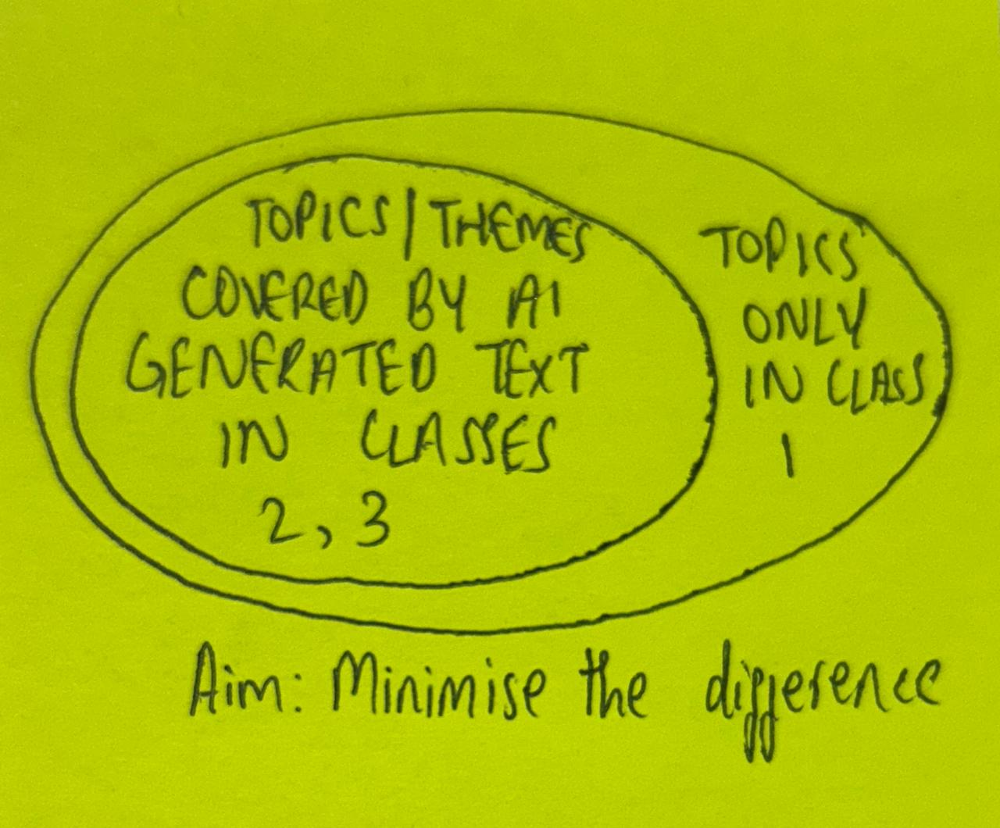

# The Dataset

> You will build a dataset where the primary variable is authorship, not topic.

I treated this instruction as the core constraint of the assignment. Since the end goal is to distinguish **human-written** text from **AI-generated** text, the dataset must minimize “shortcuts” where a classifier can succeed simply by learning **topic differences**. Instead, we want the signal to come primarily from **style** (lexical choices, sentence structure, punctuation habits, rhythm, etc.).

To achieve this, I designed the dataset so that:
- **Human text spans multiple authors** with highly distinct writing styles.
- **AI-generated text is constrained to a shared pool of topics**, so topic does not become a proxy for author/source.
- The dataset supports both the assignment baseline and additional robustness experiments.

As per the assignment instructions:
- **Class 1:** Human Written Text. This can be found in [class1-human-written/](class1-human-written/)
- **Class 2:** AI Generated Text. This can be found in [class2-ai-written/](class2-ai-written)
- **Class 3:** AI Mimicry. The AI is trained on the writing style of the author, it then generates essays on the topics as though written by the author. It exists as a harder class to the data, since the AI is purposely trying to mimic a human author. The question it's trying to answer is like *"Does style prompting actually make AI harder to detect"*

Further details regarding **Class 1** can be found in [class1-human-written/README.md](class1-human-written/README.md).

## My Venn Diagram Thought

When I was thinking of this class and the way in which to design it, I roughly sketched out a venn diagram.  
My idea is that every single topic / theme in the AI generated text, should have a corresponding mapping in the human written text. This is what I've attempted to implement. 

The converse of this statement: *"Every single topic / theme in the human written text must have a corresponding mapping to the AI generated text"*, is very difficult to achieve with **books**. Had the task been to use Wikipedia articles or instruction manuals or something of the such, this could have maybe been achieved. However, even with books, we should try to minimise the difference between the area in the circles below.

