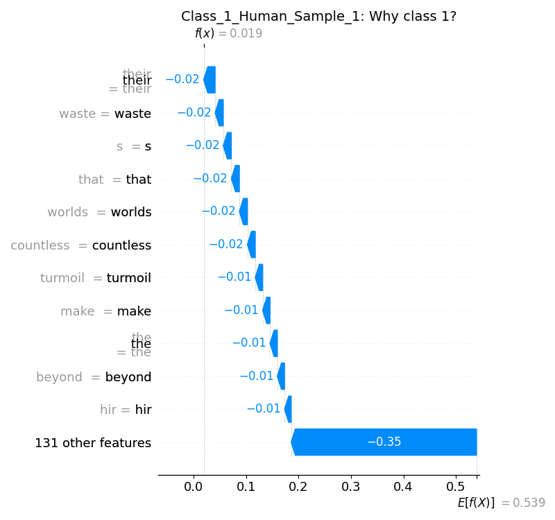
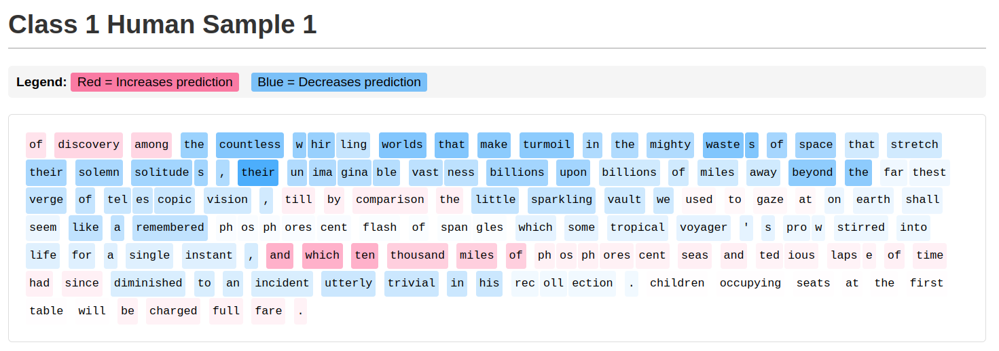
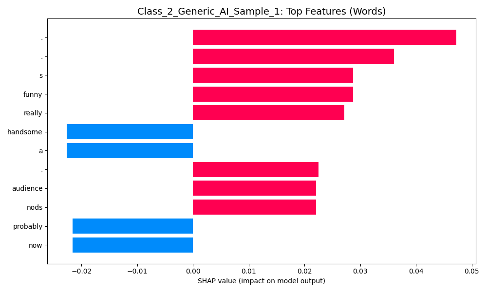
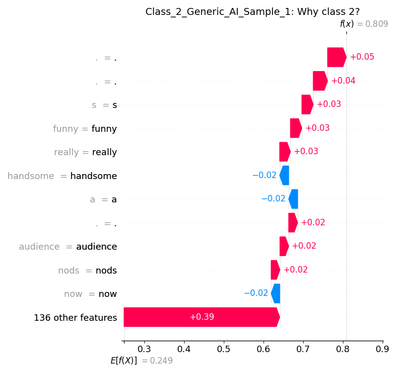
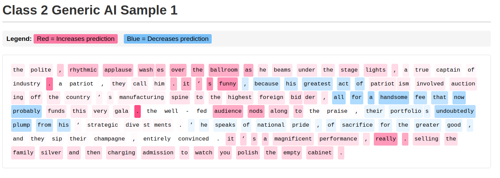
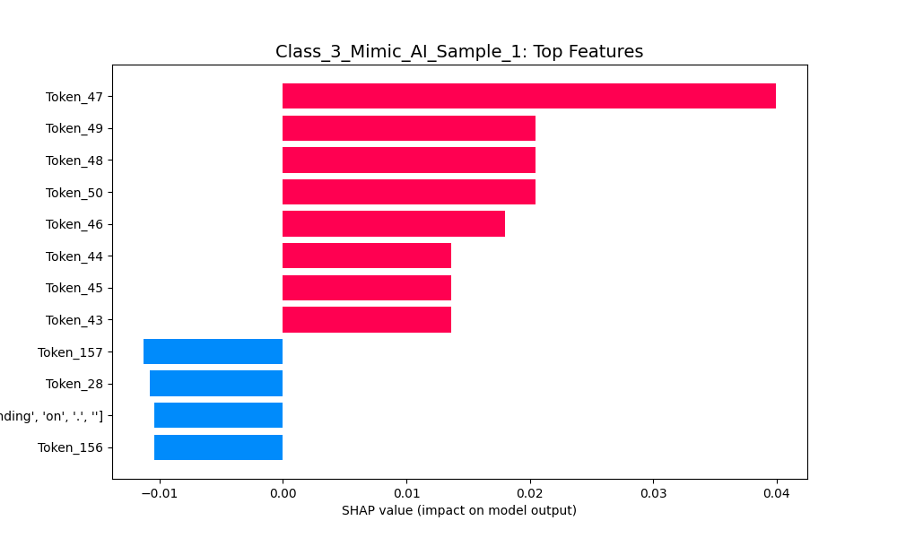
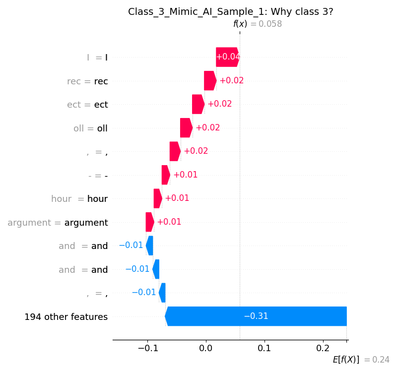
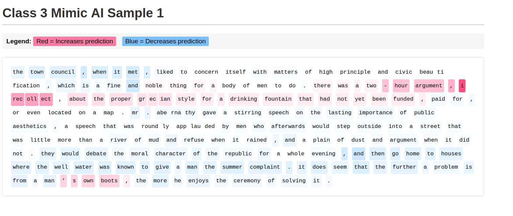

# Task-3: Saliency Mapping and Analysis

We will analyse the lowest confidence result of each class

## 1. Human-Written

Of discovery among the countless whirling worlds that make turmoil in the
mighty wastes of space that stretch their solemn solitudes, their
unimaginable vastness billions upon billions of miles away beyond the
farthest verge of telescopic vision, till by comparison the little
sparkling vault we used to gaze at on Earth shall seem like a remembered
phosphorescent flash of spangles which some tropical voyager's prow
stirred into life for a single instant, and which ten thousand miles of
phosphorescent seas and tedious lapse of time had since diminished to an
incident utterly trivial in his recollection.  Children occupying seats
at the first table will be charged full fare.

#### Bar Chart - Top Features

#### Waterfall Plot - Feature Impact

#### Text Heatmap - Word-level Analysis

For interactive heatmap, see [Class_1_Human_Sample_1_heatmap.html](low_confidence_analysis/Class_1_Human_Sample_1_heatmap.html)

**LIST OF WORDS**: their, waste, worlds, that, countless, turmoil, beyond

**KEY FINDINGS**: The model got confused because the author used very dramatic and descriptive language, which is exactly how AI often writes. It penalized the human author for sounding too much like a creative computer.

## 2. AI-Generated

The polite, rhythmic applause washes over the ballroom as he beams under the stage lights, a true captain of industry. A patriot, they call him. It’s funny, because his greatest act of patriotism involved auctioning off the country’s manufacturing spine to the highest foreign bidder, all for a handsome fee that now probably funds this very gala. The well-fed audience nods along to the praise, their portfolios undoubtedly plump from his ‘strategic divestments.’ He speaks of national pride, of sacrifice for the greater good, and they sip their champagne, entirely convinced. It’s a magnificent performance, really. Selling the family silver and then charging admission to watch you polish the empty cabinet.

#### Bar Chart - Top Features

#### Waterfall Plot - Feature Impact

#### Text Heatmap - Word-level Analysis

For interactive heatmap, see [Class_2_Generic_AI_Sample_1_heatmap.html](low_confidence_analysis/Class_2_Generic_AI_Sample_1_heatmap.html)

This was the lowest confidence, but still recognised as AI with a confidence score of 0.8.  
**LIST OF WORDS**: handsome, a, probably, now, undoubtably, plump, from, his

**KEY FINDINGS**: The model correctly identified this as AI, but its confidence dropped because the AI used specific, grounded details ("handsome fee," "plump from his strategic divestments") instead of just vague fluff. These small, concrete descriptions felt "human" enough to make the detector hesitate.

## 3. AI Mimicry

The town council, when it met, liked to concern itself with matters of high principle and civic beautification, which is a fine and noble thing for a body of men to do. There was a two-hour argument, I recollect, about the proper Grecian style for a drinking fountain that had not yet been funded, paid for, or even located on a map. Mr. Abernathy gave a stirring speech on the lasting importance of public aesthetics, a speech that was roundly applauded by men who afterwards would step outside into a street that was little more than a river of mud and refuse when it rained, and a plain of dust and argument when it did not. They would debate the moral character of the republic for a whole evening, and then go home to houses where the well water was known to give a man the summer complaint. It does seem that the further a problem is from a man’s own boots, the more he enjoys the ceremony of solving it.

#### Bar Chart - Top Features

#### Waterfall Plot - Feature Impact

#### Text Heatmap - Word-level Analysis

For interactive heatmap, see [Class_3_Mimic_AI_Sample_1_heatmap.html](low_confidence_analysis/Class_3_Mimic_AI_Sample_1_heatmap.html)

This one was classified as human with confidence 0.94

**LIST OF WORDS**: and, fine, noble, liked, concern, civic, water, complaint

**KEY FINDINGS**: The AI did too good of a job mimicking the author's voice. The model saw so many "classic" human-sounding words (like "fine and noble," "civic beautification") that it got fooled into thinking a real person wrote it, rather than an AI trying to copy a style.